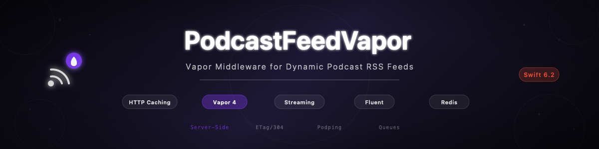

# podcast-feed-maker-vapor

[](https://github.com/atelier-socle/podcast-feed-maker-vapor/actions/workflows/ci.yml)
[](https://codecov.io/gh/atelier-socle/podcast-feed-maker-vapor)
[](https://swift.org)
[]()



Vapor middleware library for serving dynamic podcast RSS feeds. Built on [PodcastFeedMaker](https://github.com/atelier-socle/podcast-feed-maker) — the RSS generation, parsing, and validation engine — PodcastFeedVapor provides HTTP caching (ETag, Last-Modified, 304), CORS with preflight, chunked XML streaming, query-based pagination, Podping webhook notifications, batch feed auditing, Fluent protocol mapping, and optional Redis cache and queue worker targets. Modular by design: import only what you need.

Part of the [Atelier Socle](https://www.atelier-socle.com) ecosystem.

---

## Features

- **Middleware** — X-Generator header, ETag/304 HTTP caching, CORS with preflight
- **Route Builder** — `app.podcastFeed("feed.xml")` DSL for feed routes
- **Streaming** — Chunked XML streaming via `StreamingFeedGenerator` for large catalogs
- **Pagination** — Query params parsing (`?limit=N&offset=N`) with safe clamping
- **Podping** — Webhook notifications when feeds change
- **Batch Audit** — Parallel feed quality scoring with grades and recommendations
- **Fluent Mapping** — Pure Swift protocols for model-to-feed conversion
- **Redis Cache** — Optional `FeedCacheStore` protocol + Redis implementation
- **Queue Workers** — Optional background feed regeneration via Vapor Queues
- **Strict concurrency** — All types Sendable, Swift 6.2 strict concurrency

---

## Installation

### Requirements

- **Swift 6.2+** with strict concurrency
- **Vapor 4.121+**
- **PodcastFeedMaker 0.2.0+**
- **Platforms**: macOS 14+ · Linux (Ubuntu 22.04+)

### Swift Package Manager

Add the dependency to your `Package.swift`:

```swift
dependencies: [
    .package(url: "https://github.com/atelier-socle/podcast-feed-maker-vapor.git", from: "0.1.0")
]
```

Three products are available — import only what you need:

```swift
// Core (required) — middleware, routes, encoding, Fluent mapping
.product(name: "PodcastFeedVapor", package: "podcast-feed-maker-vapor")

// Optional — Redis-backed feed cache
.product(name: "PodcastFeedVaporRedis", package: "podcast-feed-maker-vapor")

// Optional — Background feed regeneration jobs
.product(name: "PodcastFeedVaporQueues", package: "podcast-feed-maker-vapor")
```

---

## Quick Start

```swift
import PodcastFeedVapor

func configure(_ app: Application) throws {
    app.feedConfiguration = FeedConfiguration(
        ttl: .hours(1),
        prettyPrint: false,
        generatorHeader: "MyApp/1.0"
    )
    app.healthCheck()
    app.middleware.use(CORSFeedMiddleware())
    app.middleware.use(PodcastFeedMiddleware())
    app.grouped(FeedCacheMiddleware()).podcastFeed("feed.xml") { req in
        try await loadFeed(on: req.db)
    }
}
```

---

## Key Concepts

### Middleware Stack

Three middlewares add production headers to feed responses. Stack them in order: CORS (outermost), generator header, cache (innermost):

```swift
app.middleware.use(CORSFeedMiddleware())
app.middleware.use(PodcastFeedMiddleware())
app.grouped(FeedCacheMiddleware(ttl: .hours(2)))
    .podcastFeed("feed.xml") { _ in feed }
```

### Feed Routes

Register feed routes with the `podcastFeed()` DSL. Supports static paths and dynamic parameters:

```swift
app.podcastFeed("feed.xml") { _ in feed }
app.podcastFeed("shows", ":showId", "feed.xml") { req in
    let showId = req.parameters.get("showId") ?? "unknown"
    return try await loadFeed(for: showId, on: req.db)
}
```

### HTTP Caching

`FeedCacheMiddleware` adds ETag (SHA256), Last-Modified, and Cache-Control headers. Returns 304 Not Modified when the client's cached version is still valid:

```swift
app.grouped(FeedCacheMiddleware(ttl: .minutes(15)))
    .podcastFeed("feed.xml") { _ in feed }
```

### Fluent Mapping

Three protocols map your types to feeds — no Fluent dependency required:

```swift
extension Show: FeedMappable {
    func toPodcastFeed() -> PodcastFeed { ... }
}
extension Episode: ItemMappable {
    func toItem() -> Item { ... }
}
let items = episodes.toItems()  // Array extension
```

### Podping and Audit

Notify aggregators when feeds change, and score feed quality in parallel:

```swift
let notifier = PodpingNotifier(client: req.client, authToken: "token")
try await notifier.notify(feedURL: "https://example.com/feed.xml", reason: .update)

app.batchAudit("feeds", "audit")
// GET /feeds/audit?urls=https://a.com/feed.xml,https://b.com/feed.xml
```

### Redis and Queues

Optional targets for production scale — no Redis/Queues dependency in core:

```swift
// Redis cache
import PodcastFeedVaporRedis
let cache = app.redisFeedCache(keyPrefix: "myapp:feed:", defaultTTL: 600)
try await cache.set(identifier: "show-123", xml: feedXML, ttl: 300)

// Queue workers
import PodcastFeedVaporQueues
app.registerFeedRegenerationJob(handler: MyFeedRegenerator())
try await req.queue.dispatch(
    FeedRegenerationJob.self,
    FeedRegenerationPayload(feedIdentifier: "show-123", reason: "episode_added")
)
```

---

## Architecture

```
Sources/
    PodcastFeedVapor/              # Core (Vapor + PodcastFeedMaker + Fluent)
        PodcastFeedMiddleware.swift
        FeedCacheMiddleware.swift
        CORSFeedMiddleware.swift
        FeedRouteBuilder.swift
        FeedResponseEncoder.swift
        FeedConfiguration.swift
        FeedPagination.swift
        StreamingFeedResponse.swift
        FluentFeedMapping.swift
        PodpingNotifier.swift
        BatchAuditEndpoint.swift
        HealthCheck.swift
        Extensions/
            Request+Feed.swift
            Response+XML.swift
    PodcastFeedVaporRedis/         # Optional Redis cache
        RedisFeedCache.swift
    PodcastFeedVaporQueues/        # Optional queue workers
        FeedRegenerationJob.swift
```

---

## Roadmap

- **DocC hosted documentation** — GitHub Pages deployment
- **Streaming cache** — Stream-through caching for very large feeds
- **Metrics** — Prometheus/StatsD middleware for feed serving metrics
- **WebSocket Podping** — Real-time podping via WebSocket instead of webhook

---

## Specification References

- [RSS 2.0 Specification](https://www.rssboard.org/rss-specification)
- [Podcast Namespace 1.0](https://github.com/Podcastindex-org/podcast-namespace/blob/main/docs/1.0.md)
- [Podping](https://podping.org/)

---

## Documentation

Full API documentation is available as a DocC catalog bundled with the package. Open the project in Xcode and select **Product > Build Documentation** to browse it locally.

Guides:

| Guide | Content |
|-------|---------|
| Getting Started | Installation and first feed route |
| Middleware Guide | Caching, CORS, and generator header |
| Feed Serving Guide | Route builder DSL, streaming, and pagination |
| Fluent Integration | Protocol-based model mapping |
| Advanced Features | Podping, batch audit, and health check |
| Redis and Queues | Optional production targets |

---

## Contributing

See [CONTRIBUTING.md](CONTRIBUTING.md) for guidelines.

---

## License

MIT License. See [LICENSE](LICENSE) for details.

Copyright (c) 2026 Atelier Socle SAS.
